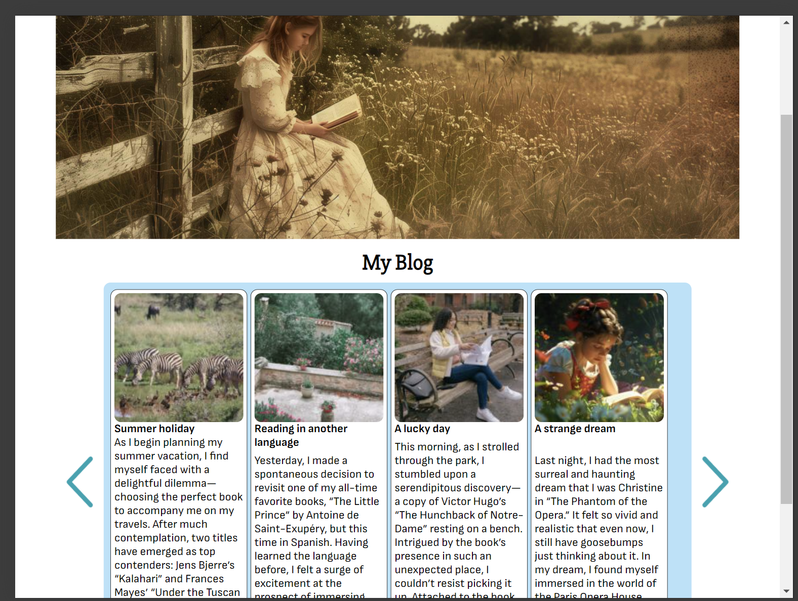

# Book blog



This project is a blog for book related content.
I use this blog to write about books I have read, and to share my thoughts and opinions on them.

## Description

The project is a static website that uses HTML, CSS, and JavaScript. The data is stored in a WordPress site, and the website uses the WordPress REST API to fetch the data and display it to the user.

### [Home Page](./index.html)

The home page features a 'Latest Posts' section, designed as a carousel (slider) for the desktop version, displays four posts at a time. Users should be able to click an arrow on the right to scroll through to the next set of posts, and an arrow on the left to view the previous set. It works on the same in the mobile version.

### [Blog Page](./blog.html)

The blog posts page show the first 10 blogs, and the user can click to view more button ,which then shows the next 10 items underneath the first 10 blogs.

### [Article Page](./article.html)

The content of the blog specific page is dynamically built using a query string parameter based on whatever link the user clicked. The title of the blog specific page changes based on the blog that has been clicked on.

### [Contact page](./contact.html)

The contact page is a form that allows users to send a message to the website owner.

On the form there are 4 textboxes:

- **Name** (Should be more than 5 characters long)
- **Email address** (Must be a valid email address)
- **Subject** (Should be more than 15 characters long)
- **Message content** (Should be more than 25 characters long)
  I have used JavaScript for validation, show error messages if the values in the textboxes do not meet the requirements.

## Built With

- HTML
- CSS
- JavaScript
- [Wordpress](https://wordpress.com/)
- [Netlify](https://www.netlify.com/)
- [Flywheel](https://getflywheel.com/)

## Getting Started

### Installing

This project is a static website, so you can simply download the files and open the `index.html` file in your browser to view the website.

Clone the repo with the following command:

```bash
git clone https://github.com/Noroff-FEU-Assignments/project-exam-1-hajnalkafenyo.git
```

### Running

To run the project, simply open the `index.html` file in your browser.

### WordPress

You can use the existing Wordpess installation configured in the JavaScript files.

To use a new WordPress site as the backend for the project, you will need to install the WordPress site on a server. You can use a service like Flywheel to host the site, or you can use a local server like Local by Flywheel.

## Contributing

Contributions are welcome! Please make a fork of the repo, make your changes and create a Pull Request. I will review the PR and merge it if it looks good.

- For CSS classes and IDs, I use the BEM naming convention, so please follow this convention when adding new styles.

## Contact

Contact me on the following social media platforms:

[LinkedIn](https://www.linkedin.com/in/hajnalka-zsobr%C3%A1kn%C3%A9-feny%C5%91-aab810130/)

## Acknowledgments

This project was made as a part of the Noroff Frontend Development course.
Thanks to my friends who tested the website and gave me feedback.
